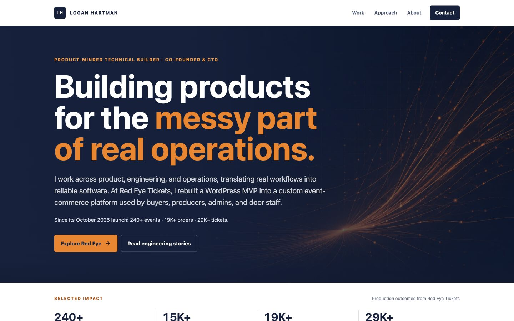

# Logan Hartman Portfolio

[](https://github.com/logan-hart/logan-hartman-portfolio/actions/workflows/ci.yml)
[](./LICENSE)

Product-engineering portfolio for Logan Hartman, built with Next.js, TypeScript, and static export. It documents how I turn operational complexity into usable systems across event commerce, payments, admissions, workflow design, reliability automation, and high-craft digital experiences.

The portfolio uses self-hosted case studies and interaction demos so the relevant product and implementation work remains understandable even when an external production site changes.



## What This Repository Demonstrates

- Product case studies organized around users, constraints, decisions, and outcomes
- A sanitized Red Eye Tickets systems narrative without production code or customer data
- Self-contained workflow and interaction demonstrations
- Responsive, accessible UI with reduced-motion support
- Static generation for fast, durable deployment
- Evidence pages for architecture decisions, reliability work, payments, and operational metrics

## Public-Portfolio Boundaries

The Red Eye Tickets production application, credentials, customer records, and private operational data are intentionally excluded. Public examples use sanitized captures, deterministic fixtures, portfolio-safe diagrams, and aggregated metrics. Client work is included only through approved or self-hosted materials.

## Sanitized Evidence

The [`evidence/red-eye`](./evidence/red-eye/) pack makes representative workflow behavior inspectable without publishing the private production application. It includes:

- a deterministic buyer, payments, and admissions workflow snapshot;
- payment and ticket-state invariants expressed independently of production models;
- provenance, redaction, and maturity boundaries; and
- an executable structural and privacy-boundary check.

Run `npm run verify:evidence` to validate the public fixture. The evidence pack is a portfolio-safe reconstruction of documented production behavior, not extracted production source or customer data.

## Local Development

```bash
npm install
npm run dev
```

Open `http://localhost:3000`.

## Static Build

```bash
npm run build
```

The static site is exported to `out/`.

The production build performs TypeScript validation and prerenders the complete static route set. GitHub Actions runs the same build for every push and pull request.

## Content Editing

- Canonical roles, dates, launch dates, and public metric floors live in `data/careerFacts.ts`.
- Profile/contact details live in `data/profile.ts`.
- Project and case study content lives in `data/projects.ts`.
- Interactive demo modules live in `components/demos/`.
- Self-hosted case-study visuals and approved local assets live in `public/images/`. Add new screenshots or screen recordings there as additional evidence becomes available.

Each client case study supports:

- `liveUrl`
- `liveUrlLabel`
- `archivedDemoUrl`
- `screenshots[]`
- `videoDemo`
- `interactiveDemoComponent`
- `permissionsNote`

Public metadata uses `NEXT_PUBLIC_SITE_URL` when supplied and otherwise uses Render's `RENDER_EXTERNAL_URL`. Contact defaults to LinkedIn; set `NEXT_PUBLIC_CONTACT_EMAIL` only after verifying the public mailbox. Set `NEXT_PUBLIC_RESUME_URL` to a public PDF path or URL to display the resume download action.

## Render Static Site

Use the Render workspace that also contains `redeyetickets`.

- Build command: `npm ci && npm run build`
- Publish directory: `out`
- Runtime: Static Site

The included `render.yaml` is ready for a Render Blueprint deployment after this repo is pushed to GitHub, GitLab, or Bitbucket. If using the Render Dashboard instead, create a new Static Site in the desired workspace and use the same build command and publish directory.

## Netlify

- Build command: `npm run build`
- Publish directory: `out`

## GitHub Pages

Use a GitHub Actions workflow that installs dependencies, runs `npm run build`, and publishes the `out/` directory. If deploying to a project subpath instead of a custom domain, set the appropriate `basePath` and `assetPrefix` in `next.config.ts`.

## License

Source code is available under the [MIT License](./LICENSE). Portfolio copy, client marks, screenshots, and other third-party visual assets retain their respective ownership and are not relicensed by the MIT License.
