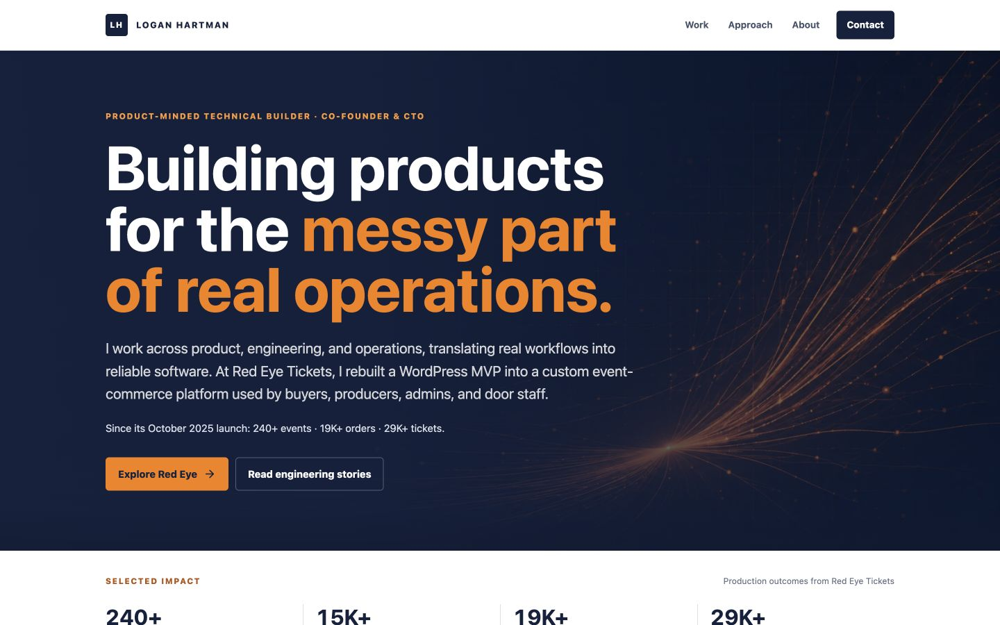

# Logan Hartman Portfolio

[](https://github.com/logan-hart/logan-hartman-portfolio/actions/workflows/ci.yml)
[](./LICENSE)

[View the live portfolio](https://logan-hartman-portfolio.onrender.com/) · [Explore Red Eye Tickets](https://logan-hartman-portfolio.onrender.com/work/red-eye-tickets/) · [Review payment reliability](https://logan-hartman-portfolio.onrender.com/work/red-eye-tickets/payment-integration/) · [Review testing, release, and recovery](https://logan-hartman-portfolio.onrender.com/work/red-eye-tickets/reliability/)

**A product engineering portfolio focused on building reliable software for real operations.**

Built with Next.js, React, and TypeScript and exported as a static site. The portfolio documents how I move from user and operator context to product decisions, full-stack implementation, testing, release, and ongoing production improvement.

The flagship Red Eye Tickets case examines how a live event-commerce platform preserves a chain of promises from payment to inventory to ticket delivery to venue admission. This repository contains the portfolio implementation and a sanitized evidence layer. It does not contain the private Red Eye production application.



## What This Repository Demonstrates

- Product case studies organized around users, constraints, decisions, implementation, and outcomes
- Reliability treated as a product responsibility across payments, inventory, ticketing, and live admissions
- Technical evidence for state integrity, retries, concurrency, partial-failure recovery, testing, and release safety
- Responsive, accessible interfaces with reduced-motion support
- Self-hosted interaction demos and case-study visuals that remain reviewable when external production sites change
- Sanitized fixtures, diagrams, aggregated metrics, and explicit maturity labels for private production work
- Static generation, metadata, structured data, sitemaps, and CI-backed builds

## Progressive 3D Scientific Visualization

The Albert Einstein case study includes an independently written Three.js
demonstration of a professional glTF and meshoptimizer workflow. Its mixed scene
uses three cropped cortical-layer surfaces and seven unrelated proofread-cell
surfaces from the public H01 release. Each structure has four precomputed GLB
levels, progressive loading, an explicit Promise-aware in-memory geometry
cache, one unified manifest and structure registry, synchronized
baseline/optimized viewers, and live performance instrumentation.

The original professional application used glTF and meshoptimizer. This
independent demonstration recreates its performance and interaction patterns
with non-proprietary assets. No original application code, institutional
assets, neurological datasets, research results, or patient information are
included.

The offline build extracts bounded layer surfaces with marching cubes, then
uses glTF-Transform and meshoptimizer for every LOD; the browser does not read
the segmentation or decimate geometry. Rebuild and test the pipeline with:

```bash
npm run assets:build
npm test
```

Important control flow:

1. `scripts/build_h01_layer_context.py` deterministically extracts H01 layer
   labels 1–3 from a fixed mip-2 crop in the same coordinate frame as the cells.
2. `scripts/build-scientific-viewer-assets.mjs` isolates and processes each
   public structure, then writes four meshopt-compressed GLBs and a manifest.
3. The case-study component fetches and validates that manifest once, then
   creates stable display state keyed by structure ID. The manifest and both
   WebGL viewers are deferred until the demo is started manually or its start
   panel is substantially visible.
4. Each plain Three.js viewer owns an explicit asset cache. The baseline asks
   for LOD 3; the progressive viewer commits LOD 0 first and requests higher
   detail only when camera distance, selection, or manual quality requires it.
5. One hysteresis-aware function chooses the progressive active LOD from camera
   distance, selection priority, and manual quality. Downloaded high LODs may
   stay cached while a lower LOD reduces current GPU work.
6. The page reports timings, transfer, request/cache counts, and current and
   loaded triangle counts from the browser session. These are illustrative
   local measurements, not universal performance claims.

Asset provenance and full MIT license texts are retained in
[`THIRD_PARTY_NOTICES.md`](./THIRD_PARTY_NOTICES.md).

## Selected Technical Evidence

- [Red Eye Tickets platform](https://logan-hartman-portfolio.onrender.com/work/red-eye-tickets/) — Product and engineering ownership across commerce, producer and administrator tools, reporting, support, and admissions
- [Payment reliability](https://logan-hartman-portfolio.onrender.com/work/red-eye-tickets/payment-integration/) — Idempotency, provider-specific protocols, signed webhooks, reconciliation, and recovery
- [Guest-checkout inventory incident](https://logan-hartman-portfolio.onrender.com/work/red-eye-tickets/guest-checkout-inventory-hold/) — Root cause, origin-bound inventory ownership, fail-closed session authorization, and the verified production fix
- [Testing, release, and recovery](https://logan-hartman-portfolio.onrender.com/work/red-eye-tickets/reliability/) — Automated verification, production canaries, release controls, rollback, and post-release validation
- [Unicode PDF incident review](https://logan-hartman-portfolio.onrender.com/work/red-eye-tickets/postmortem-unicode-pdf/) — Root-cause analysis, remediation, and regression protection at an encoding and rendering boundary
- [Metrics and methodology](https://logan-hartman-portfolio.onrender.com/work/red-eye-tickets/metrics/) — Definitions, exclusions, evidence limits, and conservative public reporting

## Public Evidence Boundaries

The Red Eye Tickets production repository, credentials, customer and attendee records, real order and ticket identifiers, raw telemetry, private endpoints, processor secrets, and private operational data are intentionally excluded.

Public examples use sanitized captures, deterministic fixtures, portfolio-safe diagrams, representative patterns, and aggregated metrics. Client work is included only through approved or self-hosted materials.

Maturity labels distinguish production systems, scoped client contributions, recreated demonstrations, and guarded or local prototypes. The public evidence pack is a reconstruction of documented behavior, not extracted production source.

## Sanitized Evidence

The [`evidence/red-eye`](./evidence/red-eye/) package makes representative workflow behavior inspectable without publishing the private application. It includes:

- a deterministic buyer, payment, and admissions workflow snapshot;
- payment and ticket-state invariants expressed independently of production models;
- provenance, redaction, and maturity boundaries; and
- an executable structural and privacy-boundary check.

Run the evidence verifier with:

```bash
npm run verify:evidence
```

## Run and Verify

Requires Node.js 20 or later.

```bash
npm ci
npm run dev
```

Open `http://localhost:3000`.

Run the repository's verification and production-build checks with:

```bash
npm run audit
npm run verify:evidence
npm test
npm run build
```

GitHub Actions runs the dependency audit, sanitized-evidence verification, and production build for pushes and pull requests.

The site is statically exported and deployed to Render using the included [`render.yaml`](./render.yaml).

## License

Source code is available under the [MIT License](./LICENSE). Portfolio copy, client marks, screenshots, and other third-party visual assets retain their respective ownership and are not relicensed by the MIT License.
