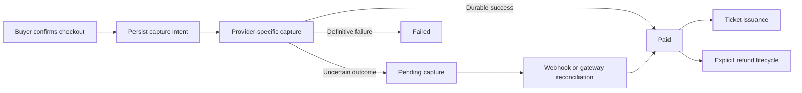

# Payment and ticket-state invariants

This is a sanitized engineering specification for the public Red Eye Tickets case study. Names and transitions are intentionally generic. It describes the product boundary without copying production models, service objects, credentials, endpoints, or processor payloads.

## Shared business boundary

Cards, Apple Pay, and Google Pay use different token and readiness protocols. They converge only after provider-specific validation, at the order and payment-ledger boundary.

```text
provider token
  -> provider-specific validation
  -> order-bound capture intent
  -> gateway result
  -> reconciled payment state
  -> ticket issuance eligibility
```

## Invariants

1. A buyer action may create at most one successful charge.
2. Idempotency is bound to the order and action, not to a replaceable single-use wallet token.
3. A successful replay returns existing payment state instead of moving money again.
4. Gateway success without durable transaction identity remains pending.
5. Tickets are issued only after payment reaches reconciled paid state.
6. Late pending or decline events cannot downgrade an already paid order.
7. Refunds, reversals, disputes, and chargebacks use explicit transitions rather than a generic status overwrite.
8. Refund state remains connected to ticket validity and admission state.
9. Logs exclude tokens, opaque wallet data, idempotency keys, PAN, and CVV.

## Recovery model



## Evidence limit

This artifact makes the correctness contract inspectable. It does not expose the private implementation or establish that a processor, wallet provider, or external auditor has certified the system.
